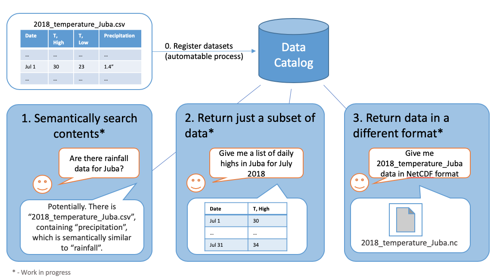

# MINT Data Catalog

## Main website
https://data-catalog.mint.isi.edu

## Summary

The goal of MINT Data Catalog is to provide the data you need in the format you want. The high-level functionality can summarized with the following image

More formally, the MINT Data Catalog is a system that provides a curated collection of *datasets*. Each **dataset** is a logical grouping of data about specific *variables* contained in one or more *resources*. The data in a dataset share metadata such as geospatial and temporal extent and provenance. Each dataset contains information about one or more **variables**, or scientific quantities of interest with a precise ontological definition. Variables are associated with one or more **standard variable** names, which are ontological classes in ontologies defined by domain scientists. Often a standard name is not sufficient to fully describe all of the metadata about a variable, so the data catalog defines a variable presentation capturing information about variables in datasets. Variable presentations include information about the variable’s representation such as the units of measure, handling of missing values, and metadata about collection. Data is physically located in one or more resources indexed by the data catalog. A **resource** can be a physical file, a web resource, or an API endpoint. For each resource, we define a layout, which captures the physical relationships between variables in the resource. For example, in a CSV file with columns corresponding to months and rows corresponding to different variables of interest (e.g., GDP, inflation rate, imports, exports, etc.), the layout specifies which row contains each variable and how those variables relate to the columns (time), while the variable presentation provides metadata such as units and how the variables were measured. 

For more information, please visit https://github.com/mintproject/MINT-DataCatalog-Public

## MINT Data Catalog API 

Many datasets that are used in MINT contain thousands or even tens of thousands of resources. Because of this, Data Catalog provides an API in order to facilitate programmatic interactivity. 

- The API is currently deployed at: https://api.mint-data-catalog.org/

- API Documentation can be found at https://data-catalog.mint.isi.edu/documentation

- There is an interactive [Jupyter Notebook](https://mybinder.org/v2/gh/mintproject/MINT-DataCatalog-Public/master?filepath=%2Fdemo%2Fapi_demo.ipynb) that can be used to play around with various API calls in a sandboxed environment (without affecting existing data)

