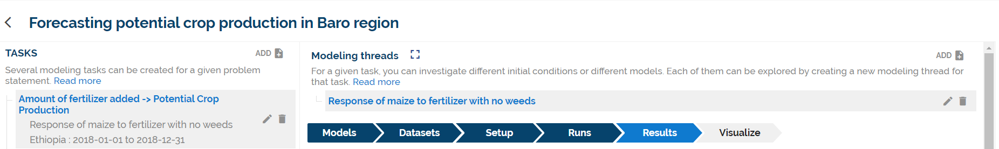

# MINT QuickStart User Guide

## Overview 
MINT assists an analyst to easily use sophisticated simulation models and data in order to explore the role of weather and climate in water on food availability in select regions of the world. For example, an analyst can use MINT to investigate the expected crop yields given different rainfall predictions through its effect on flooding and drought. MINT’s simulation models are quantitative and contain extensive subject matter knowledge. For example, a hydrology model contains physical laws that describe how water moves through a river basin, and uses data about the elevation of the terrain and the soil types to determine how
much water is absorbed in the ground and how the water flows over a land surface.

Different analysts may have different expertise and run different types of models. Each analyst is given a separate account in MINT, and their activities noted with their user name. All analysts can see the same information in their interface, so when one completes a task all the results are accessible to all the analysts. An analyst can also use MINT to investigate possible interventions. For example, changing planting windows to an earlier time might increase crop production, which can be analyzed using an agriculture model. Another possible intervention to increase crop yield is the use of fertilizer subsidies, which can be studied by using an economic model.

!!! hint "Quick links"
    * MINT Portal: https://mint.isi.edu/

## Capabilities of MINT
To enable these kinds of explorations, MINT contains a range of hydrologic, agricultural, and economic
models as well as a wealth of regional-level data needed to run those models.

After selecting a region of the world, the MINT main interface guides an analyst through a series of
tasks:

*Fig. 1: Tasks available in MINT.*

Identify geographical areas for modeling. MINT shows pre-defined areas such as river basins
for hydrology modeling, cropland areas for agriculture modeling, and administrative regions for
economic modeling.

 * **Browse and understand the models available**. A user can browse MINT’s Model Catalog to see the models available, their characteristics, their data needs, the processes they represent along with the variables involved in those processes, and the results they produce. The models in MINT have been customized to the pre-defined geographical areas.
 * **Browse the datasets available**. A user can browse the MINT’s Data Catalog to see all the datasets available. MINT is pre-populated with datasets relevant to modeling in the pre-defined regions. MINT highlights special datasets that may be of particular interest, such as high-quality datasets, necessary for the modeling tasks as well as novel datasets extracted from remote sensing data through machine learning techniques. These special datasets allow modeling experts to prepare and customize models for a region, so they have higher accuracy.
 * **Use models to run simulations that help answer questions of interest**. MINT guides an analyst through necessary steps to select and setup a model thread to run by offering sensible choices based
on the analyst’s previous selections and information about the models and data in the Model and Data Catalog. The next section provides more information on this topic.
 * **Visualize results of model runs through interactive dashboards**. Once models are run, analysts can visualize the results and include these visualizations as well as their provenance details into dynamic interactive reports.
 * **Collaborate with other users with different expertise**. Analysts can share their modeling results with others, request results from others, and discuss how to coordinate modeling tasks for consistency through a message board.

## Formulating Modeling Problems and Modeling Tasks in MINT

*Fig. 2: Problem statements in MINT.*

Analysts frame their problem into problem statements that establish the guiding context and its
associated time frame to reflect the planning horizon or time period of interest. For instance, a problem
statement can be formulated as “Explore interventions to increase agricultural productivity in South Sudan
before the 2018 lean season”.

For each problem statement, analysts can formulate modeling tasks. Each modeling task is associated
with an indicator relevant to the decision that want to inform or support. There are two types of indicators:
indices and modeling variables. For example, the problem statement of food security in South Sudan
described above, one modeling task can be framed as “Flooding effect on crop production during the
growing season”, and a separate modeling task could be “Potential crop production without flooding”. Note
that the time frame of the tasks does not necessarily reflect that of the problem statement. In the first
example, flooding is relevant to both the planting time and growing season of an agriculture model which
would place the start of the simulation earlier than the problem’s time frame.

*Fig. 3: Problem statements in MINT.*

*Fig. 4: Task form details.*

Analysts may want to explore indicators values under different initial conditions. These are expressed
as adjustable parameters and input variables of models. For instance, an analyst can explore different weed
management strategies on crop production by specifying different values for adjustable parameter that sets
the crop to weeds ratio (or range thereof) in an agriculture model.

Note that problem statements and task statements are not processed by MINT, it is simply a starting
point for an analysis. An analyst may create several problem statements, each leading to different analyses.
In contrast, MINT understands the indicators and modeling variables of modeling tasks, and uses them to
guide analysts in finding and setting up appropriate models.
Interventions reflect human actions that can change the course of a system’s behavior. They can be
explored through the settings of adjustable parameters and input variables. For example, if an agency
chooses to establish a fertilizer subsidy to incentivize farmers to plant a particular crop, an analyst can
explore these interventions by adjusting a model’s parameter for fertilizer prices. There is documentation
about this in the MINT Model Catalog, and in the Task editor when the adjustable variable chosen has an
associated intervention.

A modeling task can be accomplished through several modeling threads. Separate modeling threads
may be created to explore different aspects of the task. For example, a modeling task to explore a crop
production index may have two modeling threads, each using a different agriculture model. Separate
threads can be created to explore different initial assumptions, or to consider different indices. Each
modeling thread is independent of others.

## Using Models in MINT

MINT helps analysts to use models to accomplish the modeling tasks through several steps:

1. **Select variables**: MINT shows analysts the possible indicators that can be generated based on the
models available. The analyst can also select input variables and parameters that they wish to adjust.
2. **Select models**: MINT then shows analysts the models available that generate the indicators of
interest, and that have the adjustable parameters and intervention inputs desired by the analyst.
Analysts can compare models and select one or more models to run.
3. **Select datasets**: MINT then shows analysts the datasets that are available as inputs to the models
selected. Analysts can compare datasets and select one or more datasets to run.
4. **Set up models**: MINT shows analysts the adjustable parameters that are input to the model, and
the possible values that they can take. Analysts can select multiple parameter values which result
in different runs.
5. **Monitor the status of model runs**: This allows analysts to track model executions that take a long
time, and to be informed of execution failures.
6. **View results of model executions**: Analysts can download and save any results from models.
7. **Visualize model results**: MINT generates interactive visualizations that allow analysts to
understand the model results.

When a step has been completed, it is shown in a darker color. Users can revisit an earlier step, and if
the choices are changed for that step then the subsequent steps are canceled and need to be redone.

Each of these steps is done in a separate Web page in MINT, and has its own URL. This is very
convenient to point other analysts to a particular selection or result by sharing its URL through the message
board.

## Glossary
* **Adjustable parameter**: A parameter whose value affects an input variable of a model. For instance, an
analyst can explore different weed management strategies on crop production by specifying different values
for adjustable parameter that sets the crop to weeds ratio (or range thereof) in an agriculture model.
* **Driver**: An input dataset that creates initial conditions for a model. For example, a weather forecast.
Index: Combination of 2 or more variables that can be measured (any of which could be seen as indicators)
with the goal of using a single number for assessment and comparison purposes.
* **Indicator**: A quantifiable variable that is identified as playing a special role, namely to help characterize a
complex property of a system being modeled. Indicators can be single variables or combinations of
variables (called indices).
Input variable: A variable that will influence a response in the system, and is input to a model.
* **Modeling task**: A modeling task is accomplished through a series of modeling runs in order to answer a
question of interest.
* **Modeling thread**: A modeling thread groups together modeling runs that are conceptually related.
Modeling problem: A text statement that describes what an analyst wants to study in a system over a
specific time period. The statement is not machine readable, it is simply a mechanism for analyst to organize
their investigations.
* **System**: A physical system under study, where models capture important processes or aspects of the system
so its response to input variables can be studied.

## Frequently Asked Questions (FAQs)
**Q1**: How should I formulate problem statement?

**A1**: Problem statements are high-level problems set by the decision maker. They need to be broad enough to encompass a problem of interest.

**Q2**: How should I formulate modeling tasks?

**A2**: Modeling tasks can be formulated in any way that the analyst finds useful to decompose a problem
statement into tractable modeling tasks. For example, a separate modeling task should be created for each
indicator that needs to be generated to support the problem statement. A good practice is that each modeling
task concerns only one model or discipline, over a subregion appropriate for the model.

**Q3**: How should I use modeling threads?

**A3**: Separate modeling threads can be used to explore alternative models (i.e. run Model 2 and then run
Model 1 to see if the results are consistent and therefore there should be higher confidence in the predicted
outcomes), explore alternative values for input variables and adjustable parameters, and use different input
data.

**Q4**: Can I point another analyst to a result from my own work?

**A4**: Yes. In the message board, any message may include the URL of any page in the MINT interface. Simply cut and paste the URL of that page that contains the result or step that you want another analyst to see.

**Q5**: Can I run more than one model within a single modeling thread?

**A5**: This may come up when the output from a model may be needed as input to another model. For
example, modeling effective crop production using an economic model requires understanding how a crop
responds to changes in fertilizer rates using an agriculture model. In some cases, each model may be run
by a different analyst, but the analysts may need to coordinate the parameters and input variables for both
models to be consistent. In MINT, each model would be part of a different modeling task or thread, and the
analysts would need to communicate with one another through the message board. For example, an analyst
can start a modeling thread and send the URL of that thread via the message board to another analyst asking
them to do the modeling. The second analyst can share the results through a URL in a message.

**Q6**: Do I need to upload data to MINT?

**A6**: No. MINT already contains many relevant datasets for the regions of interest. In the future, MINT
will include capabilities for data specialists to add new data sources.

**Q7**: Do I need to add new models in MINT?

**A7**: No. MINT is pre-populated with models for the regions of interest. In the future, MINT will include
capabilities for modeling experts to add new models.