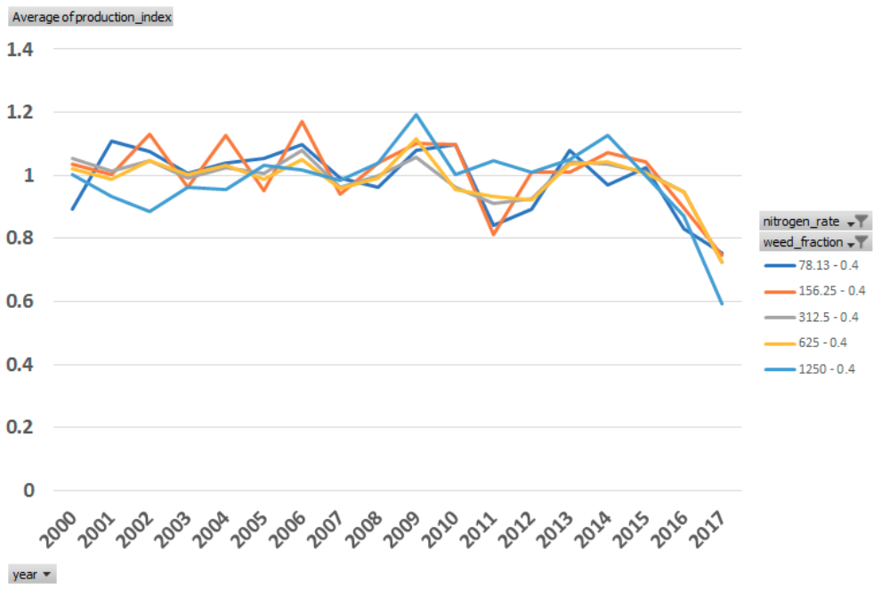
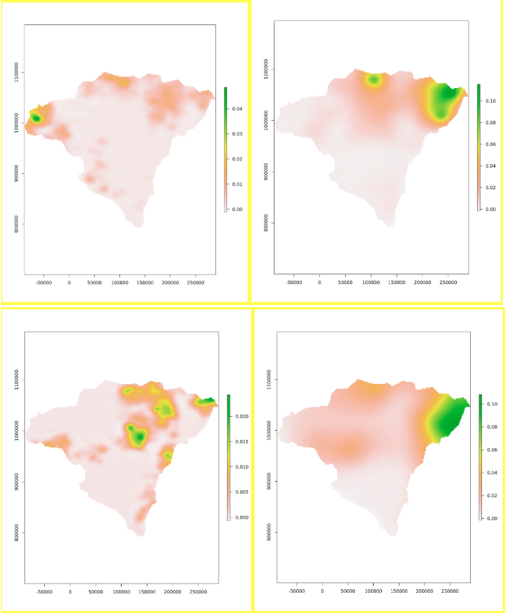
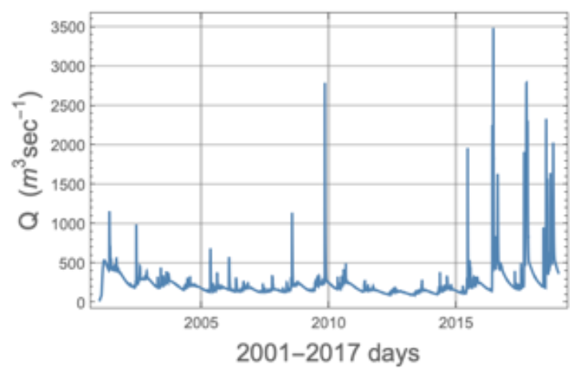
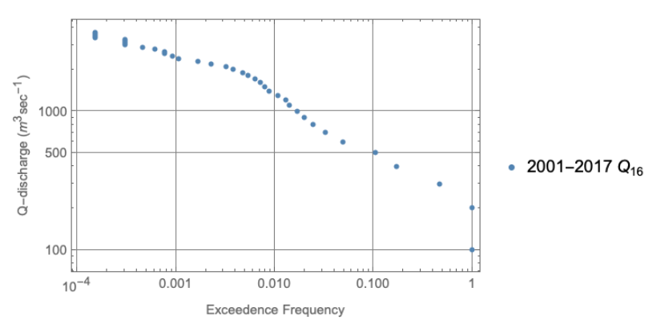
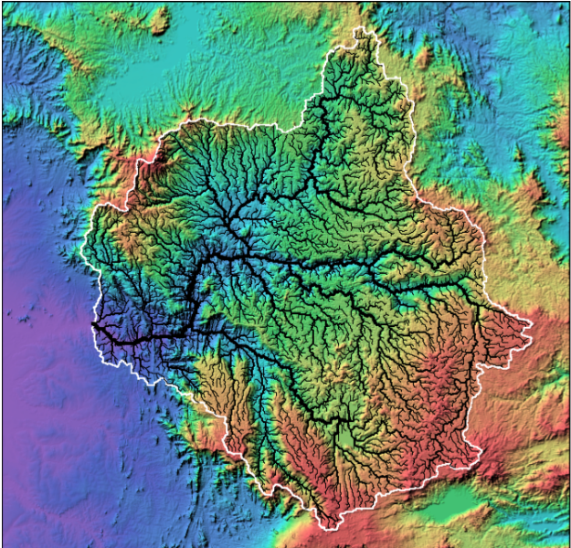

# An Overview of Indicators Generated by MINT

The rest of this document gives an overview of the indicators for each subject, and their importance for the region.

## Agriculture Indicators
The **Potential Crop Production** is generated using the Cycles model, which reports outputs for maize, sorghum, sesame and peanuts for all of South Sudan. The focus of these simulations is the first growing season (planting March through May), which leads to the late June through August harvest. The crop yields and other variables reported, correspond spatially to a climate grid (*4 x 4 km*) covering all of South Sudan.
At each grid point we simulated a full combinatorial matrix of *7* planting dates (from early to late planting), *5* nitrogen fertilization rates and *3* weed pressure levels. That provides a full range of potential situations that should encompass production conditions. We provide the model outputs, which are admittedly overwhelming and we are working on visualizations to facilitate understanding.

The **Seasonal Crop Production Index** also generated using the Cycles model, provides a fast and robust way of reporting normalized yields for a given grid point or region. The goal of the index is to easily segment *“years”* or *“seasons”* that can be problematic for food production, and to provide an intuitive sense of the magnitude of the problem. While the raw yield outputs might be difficult to interpret for the non-expert, the index is more transparent. It is based on the ratio of the yield of a given combination of planting date, fertilization and weed pressure to the median yield under such conditions across years. An *index = 1* means that the year resembles the median years, and it is assumed that it represents a neutral condition (neither local excess or shortage of food supply). An *index > 1* means that the local food supply may exceed the median, and the larger the number the better off the location. The caveat here is that flooding damage might be underestimated. As we refine our simulations this limitation will be lifted. An *index < 1* means a situation worse than normal, and the lower the value the worse the situation. It is safe to assume that this is a reliable indicator of local food shortage. We are working on visualizations that map this index, to give an analyst a sense of the geographical variation of the index. The figure below shows a summary for this index for maize for one grid point in the Pongo Basin.

*What additional information can complement this raw index?*
It would be important to have an indicator of both the technology level of a given system and the dependence of a region on the season’s harvest. The higher the technology and the lesser the dependence, the lesser the risk of an index below *1*, and conversely, the closer to technology to low-input subsistence agriculture and the higher the dependence on local food supply the more severe the risk. In other words, the index may draw the eyes quickly to the areas at risk *(index < 1)*, but context is needed for a more granular interpretation.

Figure 1 shows the Variation of the Seasonal Crop Production Index for maize for one agricultural grid point in the Pongo Basin. The nitrogen rates represent from low to high fertilization (for the agronomy minded, *78* to *1250 kg/ha* of raw fertilizer with *32%* nitrogen). The 0.4 in the legend indicates the weed pressure (medium). The planting dates are not shown here, but an analyst can easily explore their impact by expanding the data selection. Clearly, years 2011, 2016 and 2017 in particular were problematic.

*Fig. 1: Variation of the Seasonal Crop Production Index for maize for one agricultural grid point in the Pongo Basin.*

**Crop Production** is estimated using an economic model of decisions by agricultural households about the use of inputs (e.g., land and fertilizer) to produce a set of crops currently grown in the study region. The economic model consists of a numerical simulation of a non-linear constrained optimization problem that is calibrated to reflect observed decision-making in the study region. The calibration approach uses Positive Mathematical Programming (PMP), which ensures that the simulation model reflects unobserved constraints (e.g., access to credit, labor availability, crop rotation practices) that affect decisions about agricultural production. By varying related parameters (prices, land/fertilizer cost) one at a time between *-50* and *50* (increment by *10*) for each crop (cassava, sorghum, maize, groundnuts, and sesame) within MINT, simulated crop production results are generated to predict how farmers react to potential economic condition changes.

The model is aggregate and represents decision-making by all agricultural households in the study region. The model predicts agricultural production, taking into account the behavioral response of farming households to changes in environmental, economic, and policy drivers. Output variables include the total amount of land in agricultural production, the amount of land and fertilizer used per unit area in the cultivation of each of the region’s crops, average crop yields, and net revenues earned in agricultural production. For the Pongo Basin in South Sudan, the model generates these output variables for maize, cassava, sorghum, groundnuts, and sesame seed crops.

## Hydrology Indicators

We use the PIHM and TopoFlow models to generate hydrology indicators. These models require a large number of spatially-distributed input variables that describe various properties of the topography (e.g. elevation, slope, flow direction, total contributing area), the meteorology (rainfall rate, relative humidity, air temperature, surface temperature, etc.) and the soil (including many intrinsic and hydraulic properties). The models also require information about the bankfull widths, depths and bed roughness of all the channels within the river networks themselves, which are parameterized with empirical formulas.

**Geospatial Flood Exceedance index** are generated using the PIHM hydrological model. PIHM uses results from a large number of runs over time to compute statistical indexes that characterize the likelihood and potential magnitude of flooding at individual locations in a region (i.e. for every model grid cell). In this case the inundation or flooding potential is determined for 2017 as the simulated average depth of water over a given month with higher values indicating a greater likelihood of flooding. In the long term this index will be based on the full historical record allowing a probabilistic measure of flooding.

We are focused on modeling the hydrologic response to individual storms. This means computing geospatial grids that vary in time (like a movie), for the channel depths, flood depths, velocities and discharges of rivers. This type of output shows the areas where flooding occurs, as well as how long before the flooding subsides and many other related aspects of river response to given storms or droughts. We provide raw model output, as well as the data we used for the visualization below.

Figure 2 shows this index for the Lol-Kuru rivers with the outlet defined at the location just upstream of where the Pongo river enters the Lol. The visualization shows the parts of the basin where the model points to areas that are most likely candidates for flooding, crop disruption and potential migration. Higher values have a higher likelihood of flooding. In this example the sample size is too small to be reliable but future analyses will use several decades of simulation results to improve the reliability of the results including ensemble simulations.

*Fig. 2: Snapshots of the Geospatial Flood Exceedance index for Lol-Kuru (Pongo) region show that different areas are affected over time. A movie is available in the MINT indicators spreadsheet.*

The **Streamflow** - Duration Index (SDI), also called a *flow-duration-curve* (FDC), represents the relationship between the magnitude and frequency of daily streamflow for a particular river basin, and provides an estimate of the percentage of time a given streamflow was equaled or exceeded over the historical record of the data. An SDI provides a simple, yet comprehensive, graphical view of the overall historical variability associated with streamflow in a river basin. SDI is the complement of the cumulative distribution function (CDF) of daily streamflow. Each value of discharge Q has a corresponding exceedance probability, and an SDI is simply a plot Qpversus the pthquantile or percentile of daily streamflow versus exceedance probability *p = 1-Prob[Q<= Qp]*.

The SDI was computed for the simulated Lol-Kuru rivers with the outlet defined at the location just upstream of where the Pongo river enters the Lol. The simulation was for 2001-2017 daily climate data. The model was manually calibrated and inputs and outputs of the simulation can be found in the table.

Figure 3 below is the simulated runoff at the basin outlet and Figure 4 is the SDI for the basin. The daily streamflow record mirrors the seasonality of rainfall, although the peak or maximum annual daily flows show extreme fluctuations in both magnitude and frequency of occurrence. The impact of frequency-magnitude variability on food security is that droughts and floods tend to occur in clusters with memory or duration lasting several years. In addition the question of non-stationarity or time varying statistics may have to be addressed in future analyses.

*Fig. 3: The 2001-2017 daily streamflow in the Lol-Kuru catchment (Pongo), used to compute the SDI indicator*

*Fig. 4: The Streamflow duration index (SDI) for the Lol-Kuru catchment (Pongo). The SDI represents the magnitude-frequency for historical daily streamflow. Annual average flows less than the median (0.5 Exceedance) represent likely drought conditions while annual average flow greater than .001 exceedance frequency are likely associated with flooding conditions.*

We report the **River Discharge** and **River Flood Depth** computed with the TopoFlow hydrologic model for the Baro River basin draining to the town of Gambela, Ethiopia. The spatial extent of the basin in shown in Figure 5.

*Fig. 5: Shaded relief image for the Baro River basin draining to the town of Gambela, Ethiopia, with overlaid basin boundary and extracted channel network. The spatial extent of this image matches that of the 2 movies for River Discharge and River Flood Depth, with links in the spreadsheet, computed with the TopoFlow hydrologic model.*
