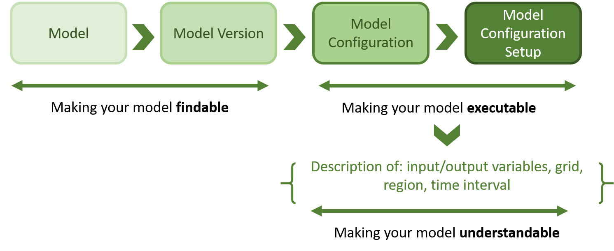
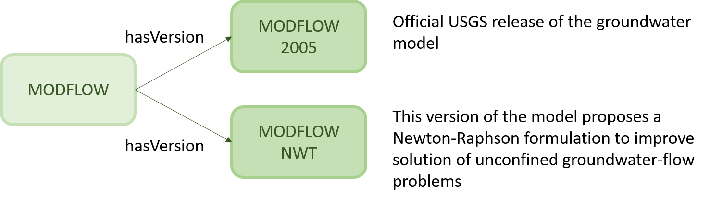
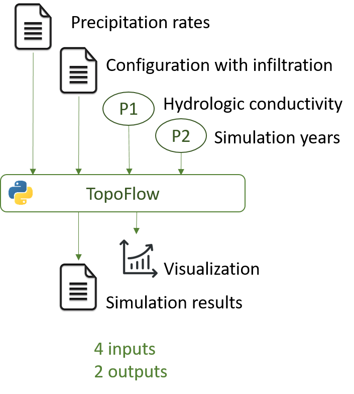
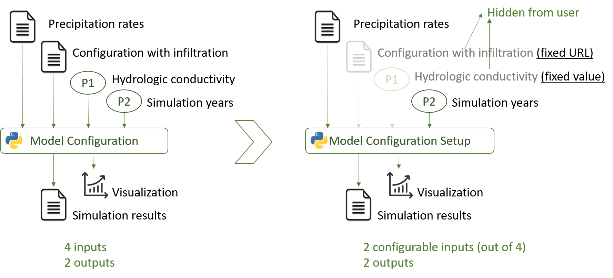
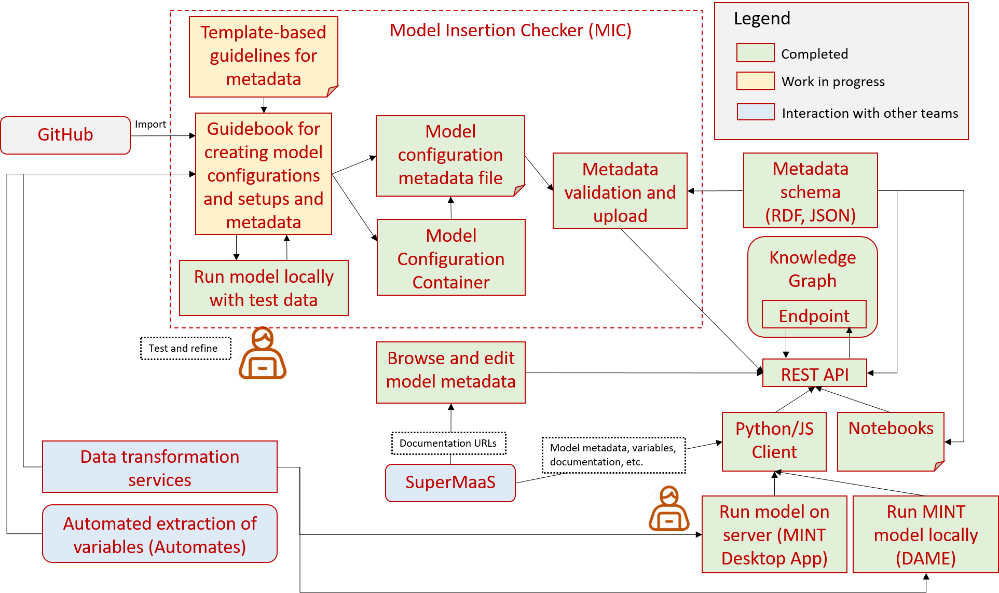

# A Quick Guide to the MINT Model Services
## Overview
The MINT Model Services describe physical, environmental and social models (e.g., climate, hydrology, agriculture or economy models) in order to:

 * **Find relevant models**, according their name, keywords, variables or region where they can be executed.
 * **Execute models**, either by providing new input files and parameters or by choosing pre-selected models that have been setup by experts.  
 * **Understand how to use models** and how to interpret their results. In order to prepare input data for model execution and ensure that users can use model results, the most relevant variables included in the input and output files should be described. Similarly, other geospatial and temporal information is critical for providing the context key to understand model results.

Figure 1 shows an overview of the main categories we use to describe models, which are further described in the following sections.

*Fig. 1: Overview of the Model Services' main categories  for finding, executing, and understanding models.*

!!! tip "Quick links"
    * GUI for exploring the contents of the model catalog: [https://models.mint.isi.edu/home](https://models.mint.isi.edu/home). [(See a video of the main features)](https://www.youtube.com/watch?v=C9rxGT2k9is)
    * REST API for adding/modifying/deleting model metadata: [https://api.models.mint.isi.edu/latest](https://api.models.mint.isi.edu/latest)
    * [Requires log in] GUI for configuring and editing models: [https://mint.isi.edu/ethiopia/models/configure](https://mint.isi.edu/ethiopia/models/configure)
    * Model services API client and examples: [https://model-catalog-python-api-client.readthedocs.io/en/latest/](https://model-catalog-python-api-client.readthedocs.io/en/latest/)
    * Model catalog API documentation: [https://model-catalog-python-api-client.readthedocs.io/en/latest/endpoints/](https://model-catalog-python-api-client.readthedocs.io/en/latest/endpoints/)

## Making your model findable
--------
This level provides a basic description of a model. At this stage, models **do not need** to be executable in order to be included in the model catalog. Making a model findable ensures that it has minimum metadata to describe its attribution, proper citation, and (if they exist) pointers to the website, creator, license, and maintainer in addition to relevant information to modelers such as a description, basic keywords and relevant assumptions.

### Model and model versions
We include two main levels of granularity for making models findable. The first involves describing the model itself, at a generic level. The second level describes the model version(s) available in the catalog. Versions do not necessarily supersede each other as models under continuous development may have multiple co-existing versions with different characteristics serving different purposes (see Figure 2).

*Fig. 2: Capturing models and model versions. The MODFLOW groundwater model has two versions, one for official USGS use and the other for a specific modeling problem. Both versions are currently in use.*

## Making your model executable
--------
The main driver for the model catalog is to make the model executable with different input variable and parameter values. For instance, the particular configuration of the Topoflow hydrology model shown in Figure 3 allows to manipulate two *input files* (precipitation and configuration files to turn on the infiltration process) and two *parameters* (hydrologic conductivity and the simulation years to run the model), which describe numerical options for the model:

*Fig. 3: TopoFlow model configuration with 2 input files, 2 input parameters, and 2 outputs.*

We may want to execute this model in a region with a certain  configuration file and precipitation rates, or we may want allow users to change both of these files to files they have created themselves. In order to support this flexibility, we distinguish among the following concepts for executing models:

### Model configuration
Represents a unique way of running a model, exposing concrete inputs, outputs, and parameters. Here we refer to *model inputs/outputs* as the data types that are used for executing the model rather than pointing to specific files. For instance, in Figure 3 the precipitation rates is a CSV file with the information about the rain amount in an area. We use the term *parameters* to refer to those values a user may be interested in changing in a model (e.g., the hydrological conductivity or the simulation years in Figure 3).

!!! hint ""
    The same version of a model may have different model configurations, which expose different functionalities. For example, TopoFlow may have another model configuration without considering infiltration, which returns different results from the one in Figure 3.

### Model configuration setup
Model configurations may have multiple parameters aimed at expert users that are too complicated and not necessarily useful to users outside the domain of expertise. A *model configuration setup* represents a layer of abstraction over a model configuration, simplifying it and making it easier to execute in a correct and meaningful manner. Using the example in Figure 3, let's create a model configuration setup for a particular region:

*Fig. 4: Main differences between model configuration and model configuration setup. While a model configuration exposes all the files and parameters needed to execute a model (2 files and 2 parameters on the left), the model configuration setup on the right simplify them (only precipitation rates and simulation years are exposed).*

As shown in Figure 4 (right), the model configuration setup has been adjusted with the input file with infiltration to a fixed URL by an expert modeler and with a fixed hydrologic conductivity value reasonable for the study region. To execute the setup, users would only have to select the precipitation files and simulation years.

!!! hint ""
    Setups may have all input files initialized by expert users, allowing variation only in the parameters that may be interesting in a region. This way users can execute model ensembles of interest without worrying about complex input file selection and preparation that may not be relevant to their task.

!!! tip "When should you use model configurations versus model configuration setups?"
    An executable model with a fixed subset of inputs is a model configuration setup. This is extremely useful to fix values for variables and parameters that (1) are invariant, (2) require lots of expertise to set correctly, (3) may not be relevant to the problem at hand.

## Making your model understandable
--------
This last level ensures that the details about the model are easy to understand by others. This task requires providing metadata in the following categories:

### Model inputs, outputs, and parameters
Because of the level of abstraction desired for model configurations and setups, they may not sufficiently describe a model for other researchers with expertise in the domain to understand and re-use them. For each input (including parameters) and output, we recommend providing a short description on how they affect the behavior of the model. For parameters, it is also necessary to describe their default values and minimum and maximum values.

### Variables and Units
Variables for each input and output datasets used in configurations should be described in as many details as possible to help with data preparation. Units are often the most important piece of information when dealing with data transformation.

!!! hint ""
    While it is not required to describe all input/output variables in a model, we recommend to describing at least all those that are critical for selecting data (e.g., precipitation variable in the Precipitation rates file of Figure 3) and plotting results.

### Grid
Models with a geospatial grid (e.g., hydrology) should describe the characteristics of the grid (point based, 2-D, irregular, etc.) so as help determine whether regridding of the inputs/outputs is necessary. In addition, providing the coordinate projection used in the input/output data is required to know how to project it in a map.

### Region
Model configurations and setups are usually calibrated or configured by experts (manually or automatically) to be run in a specific region. Hence, describing the region in which the model has been prepared to run is required to understand the context of the obtained results. For example, the hydrology model shown in Figure 3 is may configured differently in regions rich in clay, with little or no infiltration possible.

### Time Step
Different models output data at different time steps, usually depending on the data used as input. This information is necessary for data transformation and for linking models with different time requirements (e.g., a hydrology model may become unstable if run every month but monthly time steps are needed to initialize soil moisture in an agriculture model.)

## Usage Examples and Tutorial
We have prepared a set of materials to help illustrating how the model catalog API and client work.

1. Step by step example on how to search models (e.g., by keyword) with the model catalog API: [https://model-catalog-python-api-client.readthedocs.io/en/latest/models/](https://model-catalog-python-api-client.readthedocs.io/en/latest/models/)
2. Step by step example on how to retrieve the available versions of a model: [https://model-catalog-python-api-client.readthedocs.io/en/latest/modelversion/](https://model-catalog-python-api-client.readthedocs.io/en/latest/modelversion/)
3. Step by step example on how to find executable model configurations of a model: [https://model-catalog-python-api-client.readthedocs.io/en/latest/modelconfigurations/](https://model-catalog-python-api-client.readthedocs.io/en/latest/modelconfigurations/)
4. Examples on how to execute models in the model catalog with a command line client: [https://model-catalog-python-api-client.readthedocs.io/en/latest/example/](https://model-catalog-python-api-client.readthedocs.io/en/latest/example/)
5. Overview video of the main capabilities of the model catalog [(link to video)](https://www.youtube.com/watch?v=C9rxGT2k9is). A simplified overview can be seen below:

## Status 
The current model catalog API ([v1.8.0](https://github.com/mintproject/model-catalog-fastapi/), released on Oct 21th, 2022) supports:

 * Retrieving information from models [[GUI](https://models.mint.isi.edu/home), [API](https://model-catalog-python-api-client.readthedocs.io/en/latest/endpoints/), [API client](https://model-catalog-python-api-client.readthedocs.io/)]
 * Edit information from model setups [[GUI](https://mint.isi.edu/ethiopia/models/configure), [API](https://model-catalog-python-api-client.readthedocs.io/en/latest/endpoints/)] (**needs authentication**)
 * Adding new model metadata [[API](https://model-catalog-python-api-client.readthedocs.io/en/latest/endpoints/)] (**needs authentication**)
 * Current schema (draft) for representing model metadata [current schema draft](https://github.com/mintproject/ModelCatalogInsertion/blob/master/examples/SetupExample_new.yaml)
 * Command line interface for guiding, validating and helping users adding executable models ([currently under development](https://github.com/mintproject/ModelCatalogInsertion))
 
## Next steps
We are currently improving the model services to support the following capabilities:

 * **[March 30]** Desktop Application for Model Execution (DAME) for running pre-configured hydrology models locally/on a server 
 * **[April 15]** Simple model insertion for running model executables.
 * **[May 30]** Integrate data transformations for hydrology models supported.
 * **[June 30]** Model insertion through guidebook for specifying compact metadata documentation in stages of progressive detail.
 * **[July - August]** Improve integration and transition.

Figure 5 shows an overview of the components that are part of the MINT model services and the new planned enhancements. 

*Fig. 5: Overview of MINT Model Services.*
